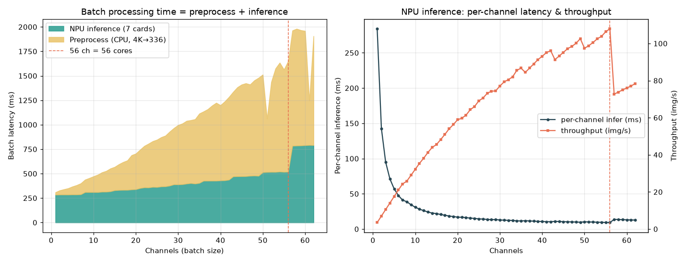

# PE-Core-L14-336 멀티카드(7×ARIES) 멀티채널 배치 지연시간 벤치마크

배치로 N채널(N장)이 **한꺼번에** 들어올 때, NPU 7대(각 8코어 = 총 56코어)에 분산 추론하여
**배치 전체가 끝나는 데 걸리는 시간**과 채널당 실효 지연을 1→62채널까지 1채널씩 측정한 결과.

지연시간은 요청이 아니라 **배치 단위**가 기준이며, 두 단계로 **분리 측정**한다:

| 단계 | 정의 | 자원 |
|---|---|---|
| **P 전처리** | 원본 이미지 N장 → 모델 입력(HWC float32). resize 336 + normalize + layout | CPU (단일, torchvision) |
| **I 순수추론** | 모델 input → output. INT8 feat MXQ(24 transformer block) | NPU trunk (7대 분산) |

> hybrid의 CPU pool head(attn_pool, 장당 ~2ms)는 별도이며 위 추론시간에 미포함.
> 추론 정확도는 원본 PE 대비 cos 0.9987로 검증됨(`SOLUTION_single_io_compile.md`).

---

## 1. 환경

| 항목 | 값 |
|---|---|
| NPU | Mobilint ARIES (aries0~6) **7대**, Aries2, 각 8코어 → **총 56코어** |
| 코어 모드 | Single (코어별 독립 처리), `set_async_pipeline_enabled(True)` |
| 분산 방식 | N채널을 7대에 **라운드로빈**(`ch i → NPU i%7`) 후 `infer_async` 전부 제출 → 전부 `get()`까지 wall-clock |
| 원본 해상도 | 3836×2146 (4K, 실제 채널 프레임) |
| 측정 | 채널 수마다 5회 median, 사전 warmup |
| 호스트 | Xeon Gold 6526Y (64T), GPU 없음 (torch CPU) |

---

## 2. 핵심 결과 (headline)

- **순수 추론은 7대로 거의 선형 확장** — 56채널을 **519ms**에 처리(채널당 9.3ms, 108 img/s). 1대 대비 **6.78배**.
- **1~7채널은 ~285ms로 평탄** — 채널을 7대에 1장씩 꽂으면 1채널 지연(284ms)과 동일. 완벽 병렬.
- **추론의 knee = 56채널(=56코어).** 57채널부터 일부 NPU가 9장(>8코어)을 받아 2번째 웨이브가 생겨 ~785ms로 계단 상승.
- **고채널에서는 전처리(CPU)가 추론보다 더 큰 병목.** 4K→336 resize가 채널당 ~18~20ms(단일 스레드)라 56채널 전처리 1131ms > 추론 519ms.
  → 전처리를 멀티프로세스/멀티스레드로 병렬화하면 전체 처리시간을 크게 더 줄일 수 있다(미적용, 개선 여지).



---

## 3. NPU 대수 스케일링 (고정 부하, 순수 추론 ms)

| 채널 | 1대 | 2대 | 4대 | 7대 | 7대 speedup |
|---:|---:|---:|---:|---:|:---:|
| 8 | 517 | 365 | 311 | 310 | ×1.67 |
| 28 | 1846 | 923 | 476 | 366 | ×5.05 |
| 56 | 3519 | 1846 | 930 | 519 | **×6.78** |

- 8채널은 1대(8코어)로도 거의 소화돼 멀티카드 이득이 작다(×1.67).
- 부하가 코어 수를 넘어설수록 카드 추가 효과가 커져 56채널에서 거의 이상적(×7)에 근접.

---

## 4. 채널별 측정 (1→62, 7대)

P=전처리(ms) / I=순수추론(ms) / Total=P+I / I/ch=추론 채널당(ms) / img/s=추론 처리량

| ch | P (ms) | I (ms) | Total (ms) | I/ch (ms) | img/s |
|---:|---:|---:|---:|---:|---:|
| 1 | 25.1 | 284.1 | 309.1 | 284.06 | 3.5 |
| 2 | 43.1 | 285.2 | 328.3 | 142.61 | 7.0 |
| 3 | 54.2 | 285.3 | 339.5 | 95.09 | 10.5 |
| 4 | 64.7 | 285.2 | 349.9 | 71.31 | 14.0 |
| 5 | 81.4 | 286.1 | 367.6 | 57.23 | 17.5 |
| 6 | 95.7 | 286.0 | 381.7 | 47.67 | 21.0 |
| 7 | 112.5 | 287.9 | 400.3 | 41.12 | 24.3 |
| 8 | 127.5 | 310.5 | 438.0 | 38.81 | 25.8 |
| 9 | 143.8 | 310.5 | 454.3 | 34.50 | 29.0 |
| 10 | 161.7 | 310.4 | 472.0 | 31.04 | 32.2 |
| 11 | 178.1 | 310.3 | 488.4 | 28.21 | 35.4 |
| 12 | 198.1 | 314.5 | 512.6 | 26.21 | 38.2 |
| 13 | 212.3 | 314.6 | 526.9 | 24.20 | 41.3 |
| 14 | 234.0 | 318.4 | 552.4 | 22.74 | 44.0 |
| 15 | 238.5 | 329.5 | 568.1 | 21.97 | 45.5 |
| 16 | 263.8 | 331.8 | 595.6 | 20.74 | 48.2 |
| 17 | 284.7 | 333.1 | 617.7 | 19.59 | 51.0 |
| 18 | 301.3 | 333.3 | 634.6 | 18.52 | 54.0 |
| 19 | 350.5 | 337.5 | 688.0 | 17.76 | 56.3 |
| 20 | 364.8 | 339.5 | 704.4 | 16.98 | 58.9 |
| 21 | 392.6 | 351.6 | 744.1 | 16.74 | 59.7 |
| 22 | 423.9 | 358.6 | 782.4 | 16.30 | 61.4 |
| 23 | 448.1 | 357.7 | 805.8 | 15.55 | 64.3 |
| 24 | 467.5 | 363.7 | 831.2 | 15.15 | 66.0 |
| 25 | 484.1 | 362.2 | 846.3 | 14.49 | 69.0 |
| 26 | 503.4 | 368.3 | 871.7 | 14.17 | 70.6 |
| 27 | 518.7 | 369.4 | 888.1 | 13.68 | 73.1 |
| 28 | 552.4 | 376.7 | 929.1 | 13.45 | 74.3 |
| 29 | 576.1 | 389.6 | 965.7 | 13.43 | 74.4 |
| 30 | 607.4 | 389.1 | 996.5 | 12.97 | 77.1 |
| 31 | 621.1 | 390.7 | 1011.8 | 12.60 | 79.3 |
| 32 | 641.6 | 397.5 | 1039.1 | 12.42 | 80.5 |
| 33 | 644.0 | 402.3 | 1046.3 | 12.19 | 82.0 |
| 34 | 658.3 | 397.5 | 1055.8 | 11.69 | 85.5 |
| 35 | 709.6 | 403.9 | 1113.5 | 11.54 | 86.7 |
| 36 | 708.2 | 426.6 | 1134.8 | 11.85 | 84.4 |
| 37 | 731.4 | 426.9 | 1158.3 | 11.54 | 86.7 |
| 38 | 767.7 | 427.0 | 1194.7 | 11.24 | 89.0 |
| 39 | 796.4 | 427.2 | 1223.6 | 10.95 | 91.3 |
| 40 | 769.6 | 429.6 | 1199.2 | 10.74 | 93.1 |
| 41 | 805.8 | 431.0 | 1236.8 | 10.51 | 95.1 |
| 42 | 845.6 | 437.2 | 1282.8 | 10.41 | 96.1 |
| 43 | 864.5 | 470.9 | 1335.4 | 10.95 | 91.3 |
| 44 | 910.0 | 472.3 | 1382.4 | 10.74 | 93.2 |
| 45 | 937.3 | 472.8 | 1410.1 | 10.51 | 95.2 |
| 46 | 950.0 | 473.3 | 1423.2 | 10.29 | 97.2 |
| 47 | 933.4 | 477.6 | 1411.0 | 10.16 | 98.4 |
| 48 | 973.2 | 479.4 | 1452.7 | 9.99 | 100.1 |
| 49 | 1001.9 | 477.4 | 1479.2 | 9.74 | 102.6 |
| 50 | 998.6 | 513.5 | 1512.0 | 10.27 | 97.4 |
| 51 | 545.7\* | 516.1 | 1061.8 | 10.12 | 98.8 |
| 52 | 919.4 | 517.2 | 1436.6 | 9.95 | 100.5 |
| 53 | 1057.4 | 516.9 | 1574.3 | 9.75 | 102.5 |
| 54 | 1113.9 | 520.2 | 1634.0 | 9.63 | 103.8 |
| 55 | 1046.4 | 517.2 | 1563.6 | 9.40 | 106.3 |
| 56 | 1131.2 | 519.0 | 1650.2 | 9.27 | **107.9** |
| 57 | 1179.2 | 784.1 | 1963.2 | 13.76 | 72.7 |
| 58 | 1194.4 | 786.1 | 1980.5 | 13.55 | 73.8 |
| 59 | 1179.1 | 787.0 | 1966.1 | 13.34 | 75.0 |
| 60 | 1168.7 | 789.8 | 1958.5 | 13.16 | 76.0 |
| 61 | 453.8\* | 791.6 | 1245.4 | 12.98 | 77.1 |
| 62 | 1115.7 | 790.6 | 1906.3 | 12.75 | 78.4 |

\* ch51·61의 전처리 값은 CPU 스케줄링 변동에 의한 outlier(미디언에도 잔존). 전처리 단계는 CPU 경합에 민감.

---

## 5. 해석

### 순수 추론 (NPU)
- **per-NPU 부하 = ⌈N/7⌉.** N≤7이면 1대당 1장 → 285ms(=단건). 부하가 늘수록 8코어 async 파이프라인이 흡수.
- **56채널까지는 1대당 ≤8장 → ~519ms 이내.** 채널당 실효 추론지연이 284ms(1ch) → **9.3ms(56ch)** 로 30배 개선.
- **57채널부터 계단 상승**(519→785ms): 1대당 9장(>8코어)이 되어 9번째 장이 다음 웨이브로 밀림.
  → 운영 권장 상한 = **56채널/배치**(=물리 코어 수). 그 이상이 필요하면 NPU 추가 또는 배치 분할.

### 전처리 (CPU) — 실질 병목
- 4K→336 resize가 채널당 ~18~20ms, 단일 스레드라 채널 수에 **선형 증가**(56ch ≈ 1.1s).
- **56채널에서 전처리(1131ms) > 추론(519ms).** 즉 현재 구성의 전체 배치시간은 전처리가 좌우.
- 개선 여지(미적용): ① 멀티프로세스/스레드 병렬 resize(호스트 64스레드 활용) ② 입력 해상도 축소/디코드 단계 통합 ③ 전처리-추론 파이프라이닝(전처리 중 NPU 동시 가동).

### 종합
- 7대 분산으로 **순수 추론 처리량 ≈ 108 img/s**(1대 15.8의 ~6.8배), 56채널 동시 추론을 약 0.5초에 완료.
- 단, end-to-end 배치시간은 전처리 병목으로 56채널 ~1.65s. 전처리 병렬화가 다음 최적화 1순위.

---

## 6. 재현

```bash
conda activate pe_npu_host          # qbruntime(cp311) + CPU torch + 모듈 deps
python bench_multinpu.py            # 1→62채널 스윕 (P/I 분리), → npu_multicard_62ch.csv
python bench_scaling.py             # 1/2/4/7대 스케일링
```
- 자산: MXQ/pool head = HF `PIA-SPACE-LAB/MXQ_NPU` 자동 다운로드. 입력 = 실제 4K 프레임.
- 원자료: `npu_multicard_62ch.csv` · 차트: `npu_multicard_62ch.png` · 스크립트: `bench_multinpu.py`, `bench_scaling.py`
