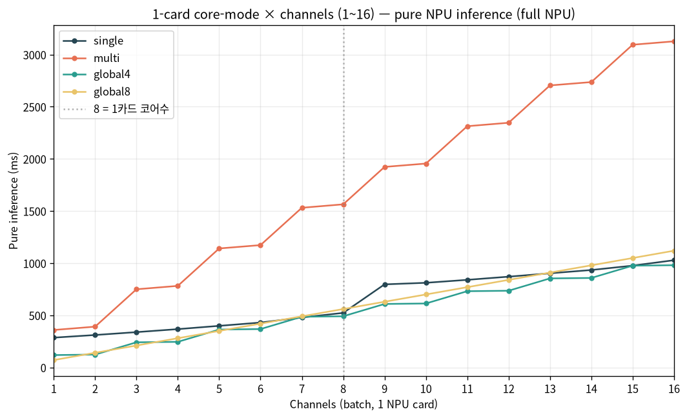

# [full NPU] NPU 1장 — 코어모드 4종 × 1~16채널 순수추론 증가폭

> **[출력 정확성 주의]** 이 문서의 수치는 `infer_async`(같은 이미지)로 측정한 **latency**다 — 시간은 유효하나, `infer_async` multi-in-flight는 서로 다른 이미지에서 출력이 깨진다(N=1만 안전). **정확한 다채널 처리 패턴(1모델+멀티스레드 sync)과 출력검증 처리량**은 → [`NPU_throughput_modes_correct.md`](NPU_throughput_modes_correct.md).

NPU **1장(8코어)** 에서 코어모드 4종(single/multi/global4/global8) MXQ로 채널을 **1→16**까지
늘리며 **순수추론(I)** 만 측정. 카드 내부 스케줄링(이미지당 코어 수 = 슬롯 수)이 채널 증가에
따라 지연을 어떻게 키우는지 본다. (full NPU = image→embedding 전부 NPU, QKᵀ16bit, cos 0.99)

- 측정: 1장(aries1), `set_async_pipeline_enabled(True)`, 동일 입력 N회 `infer_async` 제출→전부 `get()`, median of 5.
- **슬롯 = 8 / (이미지당 코어)**: single=코어1/img→**8슬롯**, global4=코어4/img→**2슬롯**, global8=코어8/img→**1슬롯**, multi=클러스터.

---

## 1. 순수추론 지연 (ms) — 채널 1~16

| ch | single | multi | global4 | global8 |
|---:|---:|---:|---:|---:|
| 1 | 286.0 | 359.5 | 118.9 | **70.9** |
| 2 | 311.3 | 391.4 | 123.5 | **140.9** |
| 3 | 338.9 | 749.9 | **241.4** | 210.5 |
| 4 | 367.7 | 782.3 | **245.7** | 280.4 |
| 5 | 399.1 | 1141.2 | **363.6** | 350.4 |
| 6 | 430.7 | 1173.3 | 368.3 | **420.4** |
| 7 | 479.3 | 1531.4 | 486.2 | **490.5** |
| 8 | **523.3** | 1564.3 | 491.0 | 560.2 |
| 9 | 796.9 | 1923.2 | **608.9** | 630.2 |
| 10 | 811.9 | 1955.2 | **613.5** | 700.0 |
| 11 | 840.2 | 2313.5 | **731.4** | 769.9 |
| 12 | 870.7 | 2346.5 | **735.8** | 839.9 |
| 13 | 902.9 | 2704.5 | **854.0** | 909.7 |
| 14 | 934.5 | 2736.5 | **858.3** | 979.4 |
| 15 | 976.5 | 3094.8 | **976.1** | 1049.5 |
| 16 | 1028.5 | 3127.2 | **980.7** | 1119.5 |



---

## 2. 모드별 증가 패턴 (슬롯 거동)

- **global8 (1슬롯)**: 채널수에 **완벽 선형** (+~70ms/채널). 1채널 **70.9ms로 최저 지연**(8코어가 1장에 집중)이지만, 1장씩 직렬이라 16채널 1120ms. → **단건/저채널 latency 최강, 고채널 비효율.**
- **global4 (2슬롯)**: **2채널마다 계단**(1~2 평탄→3~4 평탄…). 채널당 분산이 좋아 **고채널(9~16)에서 최저**(16ch 981ms). → 균형형.
- **single (8슬롯)**: 1~8채널은 8코어 파이프라인이 흡수해 286→523ms로 완만, **9채널서 점프**(523→797, 9번째가 2번째 웨이브). → **8 이하 배치에서 throughput 유리, 단건 지연(286)은 최악.**
- **multi (클러스터)**: 전 구간 **가장 느림**(1ch 360 → 16ch 3127). 이 워크로드(작은 단일 입력)에는 부적합.

## 3. 교차점 (1장 기준 모드 선택)

| 채널대 | 최저 지연 모드 | 근거 |
|------|------|------|
| **1~2 (단건/실시간)** | **global8** | 71~141ms, 8코어 집중 |
| **3~7** | **global4 / global8** 비슷 | 2슬롯 vs 1슬롯 교차 구간 |
| **8** | **global4(491)≈single(523)** | single 8슬롯 막판 |
| **9~16 (배치)** | **global4** | 16ch 981ms 최저 (single 1029, global8 1120) |
| 전 구간 | multi 비권장 | 항상 최악 |

> 핵심: **1장에서 단건 지연을 줄이려면 global8(71ms), 8채널 이상 배치 처리량이면 global4/single.**
> (여러 장 분산 시엔 single+async가 카드당 8슬롯을 꽉 채워 throughput 최선 → `NPU_multicard_62ch_full.md`.)

---

## 4. 재현
```bash
conda activate pe_npu_host
python ../scripts/bench_1card_modes.py 1      # device 1장, 4모드 × 1~16채널 순수추론
```
- MXQ = HF `PIA-SPACE-LAB/MXQ_NPU` `<mode>/pe_full.mxq` 자동 다운로드. 원자료: `bench_1card_modes.json`.
- 관련: [`NPU_coremode_benchmark.md`](NPU_coremode_benchmark.md)(다채널·메모리), [`NPU_full_pipeline_e2e.md`](NPU_full_pipeline_e2e.md)(7장 단계별)

*작성 2026-06. full NPU(QKᵀ16bit) 1장(aries1) 실측, median of 5.*
