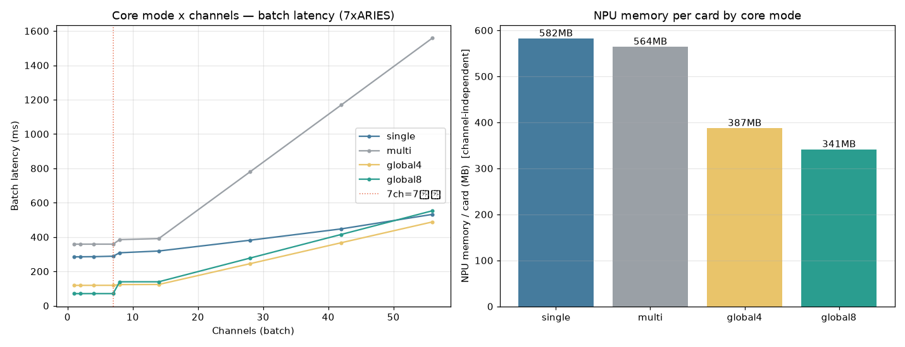

# 코어 모드(Single/Multi/Global4/Global8) × 다채널 지연·메모리 벤치 — 현재 7×ARIES 서버

NPU 코어 모드 4종을 **현재 서버(Xeon Gold 6526Y, GPU 없음, 7×ARIES=56코어)** 에서 직접 컴파일·실측.
(이전 4종 비교는 다른 테스트 머신 기록이었음 — 이 문서가 현재 환경 최초 실측.)

- 코어 모드는 **컴파일 시 고정**(`python -m pe_npu.compile --scheme single|multi|global4|global8`).
- 측정: 같은 배치 N채널을 7카드에 async 라운드로빈 분산 → 배치 전체 지연 + NPU 메모리(per card) + 호스트 RSS.
- MXQ = feat trunk(24 block, INT8), random calib. 추론 정확도와 무관(모드 특성만 비교).

## 1. 컴파일 (이 서버, `--device cpu`, GPU 없음)

| 모드 | 컴파일 시간 | MXQ 크기 | core_mode(런타임) | cores/NPU |
|------|---:|---:|------|---:|
| single | 166초 | 300MB | Single | 8 |
| multi | 236초 | 303MB | Multi | 10\* |
| global4 | 212초 | 302MB | Global4 | 10\* |
| global8 | 238초 | 303MB | Global8 | 10\* |

\* global/multi는 Local 8 + Global 2 = 10코어로 보고됨(글로벌 코어 포함).
> 컴파일 환경: 별도 conda env(`pe_compile`) — qbcompiler 1.1.2 + **torch 2.7.1**(mmc ABI 매칭 필수) +
> tensorflow-cpu/transformers/onnxruntime. CPU 컴파일도 torch는 **CUDA 빌드 .so**(libtorch_cuda.so)가
> 있어야 mmc가 로드됨(GPU 불필요, .so만 필요).

## 2. 핵심 결과



| 모드 | 단일프레임(1~7ch) | 56채널 | NPU 메모리/카드 | 성격 |
|------|---:|---:|---:|------|
| **global8** | **70.5 ms** (최저) | 553 ms | **341 MB** (최소) | 1장을 8코어가 분담 → 단건 latency 최소 |
| global4 | 118.7 ms | **488 ms** (최저) | 387 MB | 4코어 분담, 고채널 균형 최선 |
| single | 284.8 ms | 532 ms | 582 MB (최대) | 8코어 독립 → 동시성(throughput) 최대 |
| multi | 358.5 ms | 1559 ms (최악) | 564 MB | 클러스터 협력, 배치 워크로드엔 비효율 |

## 3. 채널별 배치 지연 (ms, 7카드 분산, median)

| 채널 | single | multi | global4 | global8 |
|---:|---:|---:|---:|---:|
| 1 | 284.8 | 358.5 | 118.7 | **70.5** |
| 2 | 284.9 | 358.5 | 118.6 | **70.5** |
| 4 | 285.6 | 358.6 | 118.8 | **70.6** |
| 7 | 288.5 | 358.6 | 118.9 | **70.6** |
| 8 | 308.3 | 384.9 | 123.1 | 139.4 |
| 14 | 318.6 | 391.0 | **123.7** | 139.4 |
| 28 | 381.4 | 779.6 | **244.7** | 277.4 |
| 42 | 447.4 | 1169.0 | **366.9** | 415.1 |
| 56 | 532.0 | 1559.0 | **488.1** | 553.1 |

## 4. 메모리 — 채널수와 무관히 평탄 ✅

NPU 메모리는 모델 launch 시점에 (가중치 + async 파이프라인 슬롯) **선할당**되어 **채널 수가 늘어도 증가하지 않는다.**
single 모드 실측(동일 입력 재사용 기준):

| 채널 | 1 | 8 | 28 | 56 | 112 |
|------|---|---|----|----|-----|
| NPU(MB/card) | 582 | 582 | 582 | 582 | 582 | ← **평탄** |
| host RSS(MB) | 384 | 386 | 385 | 395 | 413 | ← 미미한 증가 |

- **NPU 메모리/카드 = 코어 모드로 결정**: single 582 > multi 564 > global4 387 > **global8 341 MB**.
  - 7카드 모두 사용 시 모드별 차이가 ×7로 누적(예: single 4.1GB vs global8 2.4GB 총합).
- **호스트 RSS**: 모드 무관 ~0.4~0.5GB. 위 측정은 입력 1장 재사용이라 거의 평탄. 실서비스에선 채널마다 다른
  전처리 입력(`(3,336,336)` ≈ 1.3MB/장)이 누적되므로 호스트 메모리는 **채널수에 선형**(N×~1.3MB) 증가.

## 5. 해석 · 권장

1. **단일프레임 latency**: global8(70) < global4(119) < single(285) < multi(358).
   코어가 1장을 분담하는 global이 단건을 훨씬 빨리 끝낸다. **≤7채널(=카드수) 실시간**엔 global8 압도적.
2. **8채널 계단**: global8은 70→139(2배) — 8>7카드라 한 카드가 2장을 받는데, global은 카드당 1장씩만 빠르게
   끝내므로 2번째가 다음 웨이브로 밀림. single은 288→308(완만) — 8코어 독립이라 8번째도 동시 처리.
3. **고채널(56) throughput**: global4(488) ≈ single(532) ≈ global8(553) ≪ multi(1559).
   7카드 환경에선 global도 throughput이 좋아 **global4가 56채널에서 오히려 최선**. (단일카드였던 이전 테스트의
   "single이 throughput 최선" 결론과 달라진 지점 — 카드가 많으면 global의 낮은 단건 latency가 누적이득.)
4. **메모리**: 채널수 무관(NPU 평탄). global8이 가장 적게(341MB/card) 써서 메모리 여유도 가장 큼.

### 운영 선택 가이드
| 상황 | 권장 모드 | 이유 |
|------|----------|------|
| 실시간·저채널(≤7) | **global8** | 단건 70ms, 메모리 최소 |
| 고채널 throughput | **global4** 또는 single | 56ch에서 global4 488ms 최선 |
| 메모리 빠듯 | global8 / global4 | 341/387 MB/card |
| (비권장) | multi | 모든 채널대에서 가장 느림 |

## 6. 재현
```bash
# 컴파일 (pe_compile env: qbcompiler + torch 2.7.1)
python -m pe_npu.compile --mode compile --save pe_feat_<mode>.mxq --feat-only --scheme <mode> --device cpu
# 벤치 (pe_npu_host env: qbruntime)
python ../scripts/bench_modes.py     # 4모드 × 채널 지연 + 메모리 → ../assets/npu_coremode_modes.json
```
- 원자료: `../assets/npu_coremode_modes.json` · 차트: `../assets/npu_coremode_modes.png` · 스크립트: `../scripts/bench_modes.py`
- 관련: [`NPU_pe_multicard_62ch_hybrid.md`](NPU_pe_multicard_62ch_hybrid.md)(single 모드 62채널), [`NPU_batch_latency.md`](NPU_batch_latency.md)(단일카드 모드 비교, 이전 환경)
