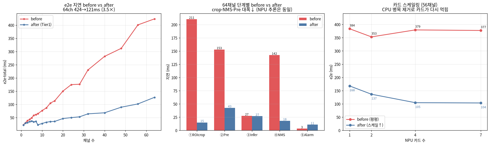

# [e2e · after] npu_intrusion 서비스 모듈 — 단계별 지연 · 카드 스케일링

[`NPU_npu_intrusion_e2e_before.md`](NPU_npu_intrusion_e2e_before.md)(before)와 **완전히 동일한 측정**을 Tier 1
최적화가 반영된 모듈로 다시 돌린 결과. 최적화 내용·원인은 [`NPU_npu_intrusion_e2e_opt.md`](NPU_npu_intrusion_e2e_opt.md).

> **구현 = Product-AI-mono 레포** (`packages/pia_prod/AI/modules/npu_intrusion/`). AX_NPU `yolo_npu/` 원본 미변경.
> 최적화 3종: ① ROIcrop 마스킹→rect 슬라이스+스레드, ② 전처리/추론 풀 분리(+cv2 threads=1), ③ 후처리 person-only fast-path.
> **알람 판정은 최적화 전후 완전 동일(16/16 대조).**

---

## 1. 환경 (before와 동일)

| 항목 | 값 |
|---|---|
| NPU | Mobilint ARIES (aries0~6) **7대**, Aries2, 각 8코어 |
| 모델 | **yolo11n / global4** INT8 MXQ, HF `PIA-SPACE-LAB/MXQ_NPU/yolo/yolo11n/global4/` |
| 입력 | `kk_helmet_1/2` **1920×1080** 실프레임(서로 다른 64장), 대구 침입 ROI |
| CPU 워커 | `cpu_workers()=16` (호스트 64코어, auto min(16,코어)) |
| 측정 | 채널·카드마다 median of 5, warmup 3 |

---

## 2. 핵심 결과 (headline)

- **e2e 64채널 424 → 121ms (3.5×), 처리량 151 → 531 img/s.** NPU/카드 추가 없이 CPU 코드만 고침.
- **단계별(64ch)**: crop 210→**17**, 전처리 153→**45**, 추론 27→27(동일), NMS 143→**18**, 알람 3→11.
- **NPU 추론은 그대로**(27ms) — 최적화가 CPU만 건드렸음을 확인. 이제 추론이 e2e의 22%로 올라와 균형.
- **카드 스케일링이 다시 먹힌다**: before는 CPU 병목이라 56ch에서 1→7카드 384→377ms **평평**했는데,
  after는 **194→113ms**로 카드에 반응. CPU를 걷어내니 추론 지분이 커져 카드가 유효.



> (좌) e2e before/after. (중) 64ch 단계별 — crop·NMS·전처리 대폭↓, NPU 추론은 동일. (우) 56ch 카드 스케일링 회복.

---

## 3. 채널 스윕 — 단계별 e2e (7카드, 최적화 후)

단위 ms(median of 5). crop=rect 슬라이스+스레드, pre=CPU 전용 풀(16), nms=person-only fast-path(순차).

| ch | ① crop | ② pre | ③ infer | ④ nms | ⑤ alarm | **e2e** | img/s |
|---:|---:|---:|---:|---:|---:|---:|---:|
| 1 | 0.9 | 5.2 | 5.4 | 0.2 | 0.02 | 21.4 | 46.7 |
| 2 | 1.0 | 17.2 | 6.0 | 0.4 | 0.02 | 27.8 | 71.8 |
| 3 | 1.5 | 17.5 | 10.3 | 1.1 | 0.62 | 29.6 | 101.3 |
| 4 | 1.5 | 6.5 | 6.6 | 1.2 | 0.62 | 32.4 | 123.4 |
| 5 | 1.8 | 10.8 | 9.9 | 1.3 | 0.63 | 33.5 | 149.3 |
| 6 | 3.5 | 7.5 | 7.1 | 1.8 | 0.91 | 38.7 | 155.1 |
| 7 | 2.1 | 8.1 | 7.2 | 1.9 | 0.91 | 34.2 | 204.7 |
| 8 | 2.5 | 7.5 | 7.4 | 2.0 | 0.90 | 20.6 | 387.7 |
| 10 | 3.7 | 9.5 | 10.5 | 2.6 | 1.18 | 27.7 | 360.5 |
| 12 | 4.3 | 12.8 | 12.2 | 2.8 | 1.18 | 33.9 | 353.8 |
| 14 | 4.1 | 13.6 | 11.6 | 3.4 | 1.47 | 35.9 | 390.4 |
| 16 | 3.7 | 14.1 | 11.4 | 3.6 | 1.42 | 35.7 | 448.0 |
| 20 | 6.1 | 19.7 | 11.2 | 5.0 | 1.74 | 42.6 | 469.1 |
| 24 | 6.1 | 20.7 | 12.3 | 5.2 | 1.99 | 53.6 | 447.5 |
| 28 | 6.7 | 27.7 | 16.5 | 6.0 | 2.29 | 56.3 | 497.1 |
| 32 | 7.9 | 28.4 | 18.6 | 6.8 | 2.53 | 66.1 | 484.3 |
| 40 | 10.3 | 32.4 | 20.6 | 8.3 | 3.04 | 73.2 | 546.5 |
| 48 | 10.5 | 37.7 | 22.7 | 11.8 | 6.95 | 90.4 | 531.0 |
| 56 | 14.8 | 43.8 | 24.5 | 15.8 | 8.95 | 107.3 | 521.9 |
| 64 | 17.0 | 44.9 | 26.7 | 18.0 | 11.25 | 120.6 | 530.8 |

> 저채널(1~8) e2e/img/s는 median-of-5여도 실프레임·워밍 변동이 있어 노이즈가 보인다(ch8이 ch7보다 낮게 나오기도).
> 추세(고채널에서 crop/pre/nms 모두 채널에 완만 선형, 추론은 ~27ms 수렴)는 명확.

---

## 4. before vs after (64채널 단계별)

| 단계 | before(ms) | after(ms) | 배수 |
|---|--:|--:|--:|
| ① ROIcrop | 210.5 | **17.0** | 12.4× |
| ② Pre | 153.0 | **44.9** | 3.4× |
| ③ Infer | 27.5 | 26.7 | 1.0× (NPU 미변경) |
| ④ NMS | 142.5 | **18.0** | 7.9× |
| ⑤ Alarm | 3.3 | 11.3 | (측정 노이즈, <12ms; crop 비트 동일이라 판정 불변) |
| **e2e-total** | **423.8** | **120.6** | **3.5×** |
| 처리량 | 151 img/s | **531 img/s** | 3.5× |

---

## 5. 카드 스케일링 — before vs after (고정 부하, e2e ms)

| 부하(ch) | 1대 | 2대 | 4대 | 7대 | 비고 |
|---:|---:|---:|---:|---:|---|
| **before 56** | 383.7 | 353.1 | 379.4 | 377.3 | CPU 병목 → **평평**(카드 무효) |
| **after 56** | 194.1 | 149.8 | 118.6 | 112.6 | CPU 제거 → **카드 반응**(1→4대 1.6×, 이후 완만) |
| after infer(56) | 88.4 | 47.2 | 28.3 | 25.3 | 추론은 카드에 비례(before와 동일) |

- after는 추론이 e2e의 유의미한 지분(56ch 25/113=22%)이 돼서 **카드 추가가 다시 효과**. 다만 4대 이후는 완만
  (남은 e2e가 전처리 CPU라 카드로는 안 줄어듦) → 4대 정도가 이 워크로드의 실효 상한.

---

## 6. 정확성 (최적화 전후 동치)

- **crop 비트 동일**: `cv_crop_region(rect)`은 애초에 no-op 마스킹이라 rect 슬라이스와 **픽셀 0개 차이**.
- **후처리 동일**: person-only fast-path = 80-class argmax와 검출 결과 동일.
- 종합: 최적화 경로 vs 전 방식 **침입 판정 16/16(+ 100프레임 스윕 100/100) 일치**. alarm ms 차이는 shapely 측정 노이즈.
- crop이 왜 비트 동일인지 단계 비교 그림은 [`NPU_npu_intrusion_e2e_opt.md`](NPU_npu_intrusion_e2e_opt.md) §① 참조.

---

## 7. 재현

```bash
conda activate pe_npu_host
cd /home/gpuadmin/AX_NPU/reports/scripts
python bench_npu_intrusion_e2e_after.py    # 정확성 대조 + 채널 스윕 + 카드 스케일링 → assets/npu_intrusion_e2e_after.json
python plot_npu_intrusion_e2e_after.py     # before/after 비교 차트 → assets/npu_intrusion_e2e_after.png
```
- 최적화 모듈 = `pia_prod.AI.modules.npu_intrusion`(detect/roi_manager/config/service). before = [`NPU_npu_intrusion_e2e_before.md`](NPU_npu_intrusion_e2e_before.md).
- 원자료: `../assets/npu_intrusion_e2e_after.json` · 차트: `../assets/npu_intrusion_e2e_after.png`

*실측 7×ARIES2, qbruntime, yolo11n/global4 INT8, 1080p 실프레임 + 대구 ROI, median of 5. 2026-07.*
