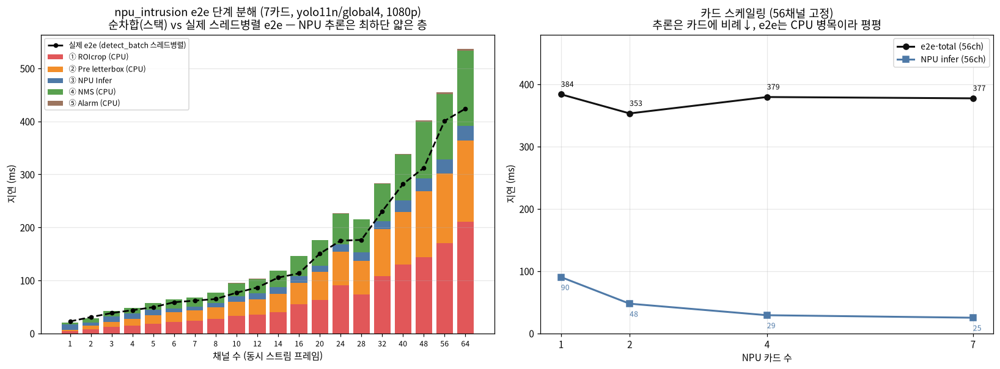

# [e2e · before] npu_intrusion 서비스 모듈 — 단계별 지연 · 카드 스케일링

`npu_intrusion`(YOLO11 NPU 침입 감지) 서비스 모듈을 **실제 `service._detect` 파이프라인 그대로**
돌렸을 때, 전처리부터 추론·후처리·알람까지 **각 단계가 얼마나 걸리는지** e2e로 측정한 실측.
입력은 실영상(대구 침입 `kk_helmet_1/2`, 1920×1080) 프레임 + 실제 대구 ROI 폴리곤.

> **이 문서 = before(진단).** 여기서 찾은 CPU 병목을 제거한 최적화(Product-AI-mono 모듈)는
> [`NPU_npu_intrusion_e2e_opt.md`](NPU_npu_intrusion_e2e_opt.md)(문제·해결), 최적화 후 재측정은
> [`NPU_npu_intrusion_e2e_after.md`](NPU_npu_intrusion_e2e_after.md)(e2e 424→121ms, 3.5×). before→opt→after.

> **이 문서 = 침입 e2e 시리즈의 베이스(before).**
> Product-AI-mono `npu_intrusion` **서비스 모듈의 실제 `_detect` e2e 5단계**(ROIcrop→전처리→추론→NMS→교집합+알람)를
> 채널·카드별로 잰다. 최적화 → [`NPU_npu_intrusion_e2e_opt.md`](NPU_npu_intrusion_e2e_opt.md),
> 최적화 후 재측정 → [`NPU_npu_intrusion_e2e_after.md`](NPU_npu_intrusion_e2e_after.md). **before→opt→after 모두 이 기준.**
>
> **⚠️ 층위 구분(비교 베이스 아님)**: [`NPU_yolo11_coremode_batch.md`](NPU_yolo11_coremode_batch.md)는
> **AX_NPU `yolo_npu` 패키지(라이브러리)** 의 순수 NPU 추론 배치(전/후처리 제외)라 **다른 레이어**다.
> 이 문서는 그 라이브러리를 vendor해 올린 **Product 서비스 모듈의 e2e**로, 직접 비교 대상이 아니다.
> (핵심 발견: 이 서비스 e2e에선 **NPU 추론이 병목이 아니라 CPU(ROIcrop/전처리/NMS)가 ~94%**.)

---

## 0. e2e 파이프라인 (service `_detect`)

```
프레임(1080p) → ① ROIcrop → ② 전처리 → ③ NPU 추론 → ④ NMS → ⑤ 교집합+알람
```

| 단계 | 정의 | 자원 | 구현 |
|---|---|---|---|
| **① ROIcrop** | ROI를 여유확장(0.1)한 rect로 crop | CPU | `cv_crop_region`(전체프레임 마스킹) — roi_manager에서 **스트림 순차 루프** |
| **② Pre** | letterbox 640 + BGR→RGB + /255 → HWC f32 | CPU | `detect.preprocess` (detect_batch 스레드 내부) |
| **③ Infer** | crop → `(1,8400,84)` (YOLO11 decode 포함) | **NPU** | 카드 라운드로빈 + 카드당 8스레드 동기 `infer()` |
| **④ NMS** | conf 필터 + xyxy 역변환 + 클래스별 NMS(person만) | CPU | `detect.postprocess` (스레드 내부) |
| **⑤ Alarm** | `calc_intersect`(bbox 마름모4점 ∩ ROI) + duration 큐 | CPU | `event`(win 25 / dur 5) |

---

## 1. 환경

| 항목 | 값 |
|---|---|
| NPU | Mobilint ARIES (aries0~6) **7대**, Aries2, 각 8코어 |
| 모델 | **yolo11n / global4** INT8 MXQ (모듈 디폴트), HF `PIA-SPACE-LAB/MXQ_NPU/yolo/yolo11n/global4/` |
| 검출 설정 | conf 0.25 / iou 0.45 / class=person(0) / bgr2rgb=True / ROI expand 0.1 |
| 입력 | `kk_helmet_1/2` **1920×1080** 실프레임(서로 다른 64장), 대구 침입 ROI 폴리곤 |
| ROI crop 크기 | 여유확장 rect **886×535** (전체 프레임의 ~22%) |
| 채널 정의 | 1채널 = 동시 스트림 1프레임 (배치로 한꺼번에 들어옴) |
| 측정 | 채널·카드마다 median of 5, warmup 3 |
| 호스트 | GPU 없음 (torch CPU), 7×ARIES |

---

## 2. 핵심 결과 (headline)

- **NPU 추론은 e2e의 ~6%뿐.** 64채널 e2e 424ms 중 추론은 **27.5ms**. 나머지 **94%가 CPU**(ROIcrop 210 + 전처리 153 + NMS 143 + 알람 3).
- **최대 단일 비용 = ROI crop.** `cv_crop_region`이 전체 1080p 프레임에 **마스킹(drawContours + bitwise_and)** 을 걸어 rect-slice 대비 **9.4배**(1.16 vs 0.12 ms/frame). 64ch면 crop만 210ms. (실은 rect를 넘겨 마스킹이 no-op → 출력은 슬라이스와 비트 동일, §5.)
- **카드를 늘려도 e2e는 안 줄어든다.** 56채널에서 추론은 카드에 비례해 90→25ms(×3.6)로 빨라지지만 **e2e는 384→377ms로 평평** — 병목이 CPU라서. (PE-Core는 NPU가 무거워 카드가 먹혔지만, yolo11n 침입은 **CPU-bound**라 정반대.)
- **처리량**: 단건 e2e 22.5ms(44 img/s), 8채널 65ms(124 img/s), 64채널 424ms(**151 img/s**). NPU 여력은 넉넉하고 CPU가 상한을 정한다.



> (좌) 단계 스택(순차합) + 실제 스레드병렬 e2e(점선). **파란 층(NPU 추론)이 최하단 얇은 띠** — 나머지가 전부 CPU.
> (우) 56채널 고정 카드 스케일링: 추론(파랑)은 카드에 비례해 내려가지만 e2e(검정)는 CPU 병목이라 평평.

---

## 3. 채널 스윕 — 단계별 e2e (7카드, yolo11n/global4)

단위 ms(median of 5). crop/pre/nms/alarm = **각 단계 순차 wall-clock**, e2e = **실제 모듈 경로**
(ROIcrop 순차 + `detect_batch`가 pre+infer+nms를 스레드로 겹침 + alarm). img/s = e2e 기준.

| ch | ① crop | ② pre | ③ infer | ④ nms | ⑤ alarm | 순차합 | **e2e-total** | img/s |
|---:|---:|---:|---:|---:|---:|---:|---:|---:|
| 1 | 3.7 | 3.2 | 9.6 | 3.8 | 0.01 | 20.3 | 22.5 | 44.5 |
| 2 | 8.1 | 6.1 | 6.1 | 7.7 | 0.01 | 28.0 | 30.6 | 65.3 |
| 3 | 12.5 | 9.0 | 10.4 | 10.1 | 0.42 | 42.4 | 38.2 | 78.5 |
| 4 | 15.0 | 11.8 | 10.3 | 10.7 | 0.36 | 48.2 | 43.6 | 91.7 |
| 5 | 18.2 | 15.4 | 10.6 | 13.2 | 0.34 | 57.7 | 49.3 | 101.4 |
| 6 | 21.3 | 18.7 | 7.2 | 16.4 | 0.44 | 64.0 | 58.7 | 102.3 |
| 7 | 23.6 | 19.5 | 7.6 | 16.4 | 0.43 | 67.5 | 61.7 | 113.5 |
| 8 | 27.2 | 22.0 | 8.0 | 19.1 | 0.42 | 76.7 | 64.7 | 123.6 |
| 10 | 33.3 | 26.0 | 11.0 | 24.1 | 0.51 | 94.9 | 76.7 | 130.5 |
| 12 | 35.8 | 28.2 | 11.1 | 27.5 | 0.49 | 103.1 | 86.4 | 138.9 |
| 14 | 39.6 | 35.1 | 12.2 | 30.8 | 0.59 | 118.3 | 105.1 | 133.2 |
| 16 | 54.4 | 41.1 | 12.6 | 37.7 | 0.61 | 146.4 | 113.1 | 141.4 |
| 20 | 62.8 | 53.2 | 11.3 | 48.3 | 0.66 | 176.3 | 150.3 | 133.1 |
| 24 | 90.1 | 64.4 | 13.9 | 57.3 | 0.74 | 226.4 | 174.8 | 137.3 |
| 28 | 73.6 | 63.1 | 16.4 | 61.7 | 0.81 | 215.6 | 176.3 | 158.9 |
| 32 | 107.7 | 88.6 | 15.8 | 69.7 | 0.89 | 282.7 | 230.2 | 139.0 |
| 40 | 129.7 | 99.5 | 21.4 | 87.2 | 1.04 | 338.8 | 281.7 | 142.0 |
| 48 | 144.0 | 124.0 | 24.2 | 107.8 | 2.14 | 402.1 | 312.1 | 153.8 |
| 56 | 169.6 | 131.6 | 27.0 | 123.6 | 2.66 | 454.5 | 400.9 | 139.7 |
| 64 | 210.5 | 153.0 | 27.5 | 142.5 | 3.31 | 536.8 | 423.8 | 151.0 |

> **순차합 vs e2e**: 각 단계는 순차 루프로 잰 값(합=순차합)이고, 실제 `detect_batch`는 pre+infer+nms를
> 스레드로 겹쳐서 e2e < 순차합(64ch 537→424). 단 **ROI crop은 roi_manager에서 순차 루프**라 그대로 e2e에 실린다 → e2e의 최대 단일 요소.
> **추론(③)은 채널이 늘어도 거의 평평**(7코어×8=56슬롯, 64ch도 ⌈64/7⌉ 웨이브라 ~27ms) — CPU 단계만 채널에 선형.

---

## 4. 카드 스케일링 — 고정 부하 (e2e-total / NPU infer, ms)

카드에 라운드로빈 분산 + 카드당 8스레드 동기 infer. median of 5.

| 부하(ch) | 지표 | 1대 | 2대 | 4대 | 7대 |
|---:|---|---:|---:|---:|---:|
| 8 | infer | 16.1 | 14.0 | 11.4 | 10.3 |
| 8 | **e2e** | 68.8 | 66.9 | 69.3 | 61.6 |
| 28 | infer | 48.1 | 27.7 | 18.6 | 16.6 |
| 28 | **e2e** | 185.9 | 184.9 | 183.4 | 201.7 |
| 56 | infer | 90.3 | 47.6 | 29.1 | **25.0** |
| 56 | **e2e** | 383.7 | 353.1 | 379.4 | **377.3** |

- **추론은 카드에 비례해 내려간다**(56ch: 1대 90 → 7대 25ms, ×3.6). 검출기 자체는 멀티카드 확장이 잘 됨(→ `NPU_yolo11_coremode_batch.md`와 일치).
- **그런데 e2e는 평평**(56ch 384→377ms). 추론이 e2e의 소수 지분(90/384=23% → 25/377=7%)이라, 그걸 줄여도 CPU(crop/pre/nms)가 그대로라 총합이 안 준다.
- 즉 **이 워크로드(yolo11n 침입)에서 카드 추가는 e2e에 무의미.** 카드는 (a) 더 무거운 모델(11m/11l)로 추론 지분이 커지거나, (b) CPU 단계를 먼저 병렬화해 추론이 병목이 됐을 때 효과가 난다.

---

## 5. 왜 ROI crop이 최대 비용인가 (그리고 왜 no-op였나)

`roi_manager`가 `cv_crop_region`에 넘기는 `region`은 **ROI 폴리곤이 아니라 확장된 rect(사각형,
`calc_expand_coord` 반환값)** 다. `cv_crop_region`은 폴리곤 마스킹용 범용 함수(전체 프레임 크기
마스크 생성 → `drawContours` 채움 → `bitwise_and`)인데, **사각형을 넘기면 마스크가 crop 영역 전체를
덮어 지워지는 픽셀이 없다(no-op).** 즉 전체 1080p 마스크 할당 + drawContours + bitwise_and를 매 프레임
다 하고서 **결과는 `frame[y0:y1, x0:x1]` 단순 슬라이스와 비트 단위로 동일**한 것을 만들고 있었다.

| 방식 | ms/frame(1080p) | 출력 |
|---|---:|---|
| `cv_crop_region(region=rect)` (현재, Daegu 계승) | **1.16** | rect 슬라이스와 **비트 동일** |
| 단순 rect slice `frame[y0:y1, x0:x1]` | **0.12** | (동일) — **9.4× 빠름** |

- 64채널이면 crop만 210ms → rect-slice면 ~23ms 수준으로 기대.
- **rect-slice로 바꿔도 출력 픽셀 0개 차이(검증)**: crop 결과 비트 동일 → 검출·알람 동일(100/100 프레임).
  cv_crop_region이 만약 **폴리곤**으로 마스킹했다면 코너가 검게 되어 달라졌겠지만, 모듈은 rect를 넘겨 no-op였다.
  → 최적화(rect_crop) 상세: [`NPU_npu_intrusion_e2e_opt.md`](NPU_npu_intrusion_e2e_opt.md) §①.

---

## 6. 해석 / 최적화 우선순위

- **NPU는 놀고 있다.** yolo11n(6MB, 채널당 ~2ms)에 작은 crop(886×535→letterbox 640) 입력이라 추론이 가볍다. PE-Core(ViT-L, 63ms/img)와 정반대 — 침입 e2e의 상한은 전적으로 CPU가 정한다.
- **최적화 1순위 = ROI crop을 rect-slice로** (§5). 단일 변경으로 최대 단계를 ~9배↓, **출력 비트 동일이라 정확도 영향 0**. `roi_manager.process_batches_with_roi`만 수정.
- **2순위 = CPU 단계 병렬화/파이프라이닝.** crop이 현재 순차 루프 → detect_batch처럼 스레드풀로. 전처리(letterbox)·NMS도 이미 스레드 안이지만 crop이 밖이라 e2e에 그대로 실림. (PE의 `NPU_preprocess_1_parallel.md`와 같은 방향.)
- **3순위 = 카드 추가는 이 모델에선 e2e에 효과 없음** (§4). 무거운 모델로 갈 때만.
- 참고 상한: CPU를 최적화해 추론이 병목이 되면 7카드 yolo11n은 §4 기준 채널당 ~0.45ms(56ch 25ms)라 이론상 e2e가 크게 낮아질 여지가 있다.

---

## 7. 재현

```bash
conda activate pe_npu_host
cd /home/gpuadmin/AX_NPU/reports/scripts
python bench_npu_intrusion_e2e.py     # 채널 스윕(§3) + 카드 스케일링(§4) → assets/npu_intrusion_e2e_before.json
python plot_npu_intrusion_e2e.py      # 차트 → assets/npu_intrusion_e2e_before.png
```
- MXQ = HF `PIA-SPACE-LAB/MXQ_NPU/yolo/yolo11n/global4/` 자동 다운로드. 입력 = `assets/videos/kk_helmet_1/2.mp4`.
- 모듈 경로(ROIcrop/전처리/NMS/교집합)는 `pia_prod.AI.modules.npu_intrusion`을 그대로 호출 — 실제 서비스와 동일.
- 원자료: `../assets/npu_intrusion_e2e_before.json` · 차트: `../assets/npu_intrusion_e2e_before.png`

*실측 7×ARIES2, qbruntime, yolo11n/global4 INT8, 실영상 1080p + 대구 ROI, median of 5. 2026-07.*
