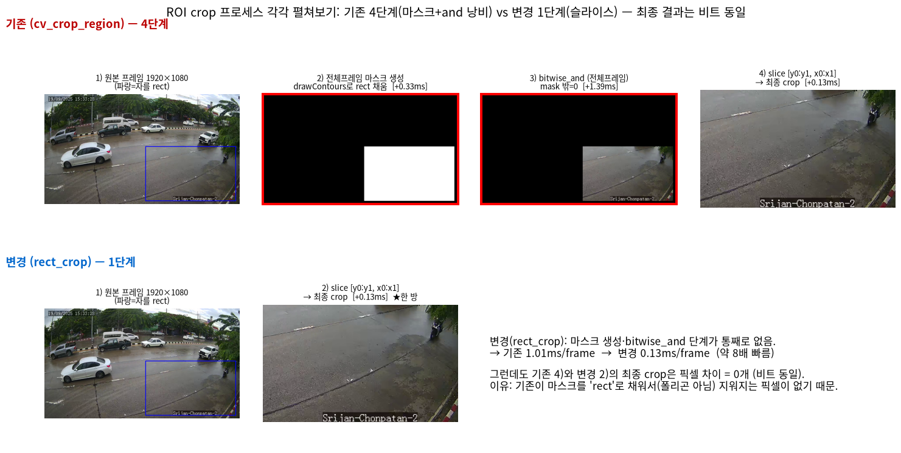

# [e2e · 최적화] npu_intrusion — 무엇이 문제였고 어떻게 고쳤나

`npu_intrusion`(YOLO11 NPU 침입 감지) 서비스 모듈의 e2e 지연을 진단
([`NPU_npu_intrusion_e2e_before.md`](NPU_npu_intrusion_e2e_before.md), before)한 결과 **병목이 NPU가 아니라
CPU(ROIcrop/전처리/NMS)였고**, 그 원인을 제거한 최적화(Tier 1)의 문제·해결 기록.

> **⚠️ 구현 위치 = Product-AI-mono 레포** (`packages/pia_prod/AI/modules/npu_intrusion/`).
> AX_NPU의 `yolo_npu/`(vendor 원본)는 **건드리지 않았다.** npu_intrusion은 `yolo_npu`를 self-contained
> vendor 한 모듈이라, 이 최적화는 **Product-AI-mono 쪽 모듈 코드에만** 반영했다.
> 측정 전/후: before=[`NPU_npu_intrusion_e2e_before.md`](NPU_npu_intrusion_e2e_before.md) · after=[`NPU_npu_intrusion_e2e_after.md`](NPU_npu_intrusion_e2e_after.md).

## 한 줄 결과

**e2e 424ms → 121ms (64채널, 3.5×), 처리량 151 → 531 img/s. 알람 판정은 최적화 전후 완전 동일(16/16).**
전부 "일을 덜/맞게 하기"이고 NPU/카드 추가 없이 CPU 코드만 고쳤다.

---

## 진단: 왜 CPU가 병목이었나 (before)

before 측정(7카드, yolo11n/global4, 1080p 실프레임)의 64채널 단계별:

| 단계 | before | e2e 비중 | 문제 |
|---|--:|--:|---|
| ① ROIcrop | 210 ms | 최대 | `cv_crop_region`이 **전체 1080p 프레임 폴리곤 마스킹**(drawContours+bitwise_and) + roi_manager에서 **순차 루프** |
| ② 전처리(letterbox) | 153 ms | 큼 | detect_batch 스레드풀이 **카드×8=56워커** → CPU resize가 코어를 초과 점유(오버서브스크립션) |
| ③ NPU 추론 | 27 ms | ~6% | (병목 아님 — NPU는 놀고 있음) |
| ④ NMS/후처리 | 143 ms | 큼 | NMS가 아니라 **8400×80 score `argmax/max`** (검출은 프레임당 <1개인데도) |
| ⑤ 알람 | 3 ms | 무시 | — |
| **e2e** | **424 ms** | | 추론(27ms)은 e2e의 6%, 나머지 94%가 CPU |

핵심: **NPU(yolo11n, 채널당 ~2ms)는 놀고 있는데 CPU 3군데가 e2e를 잡아먹고 있었다.**

---

## 문제별 원인 · 해결 (Tier 1)

### ① ROI crop — no-op 마스킹 제거 → rect 슬라이스 + 스레드 (출력 비트 동일)

**문제**: `roi_manager`는 `pia.vision.roi.roi_manager.cv_crop_region`으로 crop했는데, 넘기는
`region`이 **ROI 폴리곤이 아니라 확장된 rect(사각형, `calc_expand_coord` 반환값)** 이다.
`cv_crop_region`은 원래 폴리곤 마스킹용 범용 함수(전체 프레임 크기 마스크 생성 → `drawContours`로
영역 채움 → `bitwise_and`)인데, **사각형을 넘기면 마스크가 crop 영역 전체를 덮어 지워지는 픽셀이
하나도 없다(no-op).** 즉 전체 1080p 프레임 마스크 할당 + drawContours + bitwise_and를 매 프레임 다
하고서 **결과는 `frame[y0:y1, x0:x1]` 단순 슬라이스와 비트 단위로 동일한** 것을 만들고 있었다.



> **위=기존 `cv_crop_region` 4단계**: 원본 → ② 전체프레임 마스크 생성(drawContours로 rect 채움) →
> ③ bitwise_and(전체프레임) → ④ slice. **②·③이 낭비**(빨강). **아래=변경 `rect_crop` 1단계**: 원본 → slice.
> ③ 이미지를 보면 마스크가 **rect 모양**이라 자를 rect 영역은 그대로 남는다 → 그 비싼 연산이 결과를
> 하나도 안 바꾼다. 그래서 최종 crop은 **픽셀 0개 차이(비트 동일)**, 시간만 **1.0 → 0.13 ms/frame(≈8×)**.

| crop 방식 | 단계 | ms/frame(1080p) | 출력 |
|---|---|--:|---|
| `cv_crop_region(region=rect)` (현재) | 마스크+and+slice (4) | **1.16** | rect 슬라이스와 **비트 동일** |
| 단순 rect slice `frame[y0:y1, x0:x1]` | slice (1) | **0.12** (9.4×↓) | (동일) |

**출력이 같음(검증)**: 실프레임에서 두 crop의 **픽셀 차이 = 0** (886×535 전 픽셀 동일),
검출·침입 알람도 **100/100 프레임 일치**. 단계 비교 그림 `../assets/crop_pipeline_steps.png`
(재현 `../scripts/viz_crop_pipeline_steps.py`), 검출·알람 대조 그림 `../assets/crop_mask_vs_rect.png`
(`../scripts/viz_crop_mask_vs_rect.py`).

**해결** (`roi_manager.py`): `cv_crop_region` → 새 `rect_crop()`(마스킹 없는 numpy 슬라이스)로 교체 +
`process_batches_with_roi`의 순차 crop 루프를 **스레드풀(코어 수, 기본 16)로 병렬화**.
ROI 조회/등록(`get_roi_info`, 캐시 변경)은 순차로 두고 crop만 스레드. crop 원점(=expanded_roi 좌상단)이
그대로라 `roi_in_crop` 교집합 좌표계도 유효. **출력 비트 동일 + ~9× 빠름(정확도 영향 0).**
→ 64ch crop **210 → 17 ms.**

### ② 전처리(letterbox) — 추론 풀과 CPU 작업이 뒤엉킴 → 풀 분리

**문제**: `YOLONPU.detect_batch`가 한 스레드풀(**num_threads(8)×카드(7)=56워커**)에서 전처리+추론+후처리를
한꺼번에 돌렸다. NPU 동기 infer 제출은 56 in-flight여도 되지만, **CPU resize를 56스레드로 동시에**
돌리면 코어(경합·컨텍스트 스위칭)를 초과 점유해 오히려 느려진다.

    전처리 64장:  1스레드 264ms → 16스레드 82ms → 32스레드 118ms  (56이면 더 나쁨)

**해결** (`detect.py`): 두 병렬성을 **분리** — pe_npu가 이미 쓰던 방식.
- `_pool`(num_threads×카드) = **NPU infer 제출 전용**.
- `_cpu_pool`(코어 수, 기본 `min(16, os.cpu_count())`) = **CPU 전처리 전용**.
- `cv2.setNumThreads(1)` — 프레임별로 스레드 병렬하므로 cv2 내부 스레드는 1로 고정(중첩 오버서브 방지).
- `detect_batch`를 단계 분리: ① 전처리(_cpu_pool) → ② 추론(_pool) → ③ 후처리(순차).
→ 64ch 전처리 **153 → 45 ms.**

> pe_npu는 이걸 `PE_NPU_SLOTS_PER_CARD`(infer 슬롯, 코어모드 자동) + `PE_NPU_PREPROCESS_WORKERS`(전처리
> 별도 풀)로 이미 구현해 뒀는데([`NPU_preprocess_1_parallel.md`](NPU_preprocess_1_parallel.md)),
> npu_intrusion은 단순한 `yolo_npu` 경로를 vendor 해서 이 구조가 없었다. 그걸 이식한 것.

### ③ 후처리 — 80-class argmax → 단일클래스 fast-path

**문제**: `postprocess`가 매 프레임 8400×80 score에 `argmax(1)`/`max(1)`를 했다. 침입은 **person(class 0)만**
쓰는데도 80클래스 전체를 훑어서, 검출이 프레임당 <1개인데도 후처리가 143ms(64ch).

**해결** (`detect.py`): `classes`가 단일이면 **argmax를 스킵하고 그 클래스 컬럼만** 읽는다.
```python
if classes is not None and len(classes) == 1:
    conf = scores[:, classes[0]]      # person 컬럼만
    ...
```
→ 후처리 **143 → 18 ms** (probe 단독 측정 시 122→4.3ms, 28×). 검출/알람 결과 동일.

---

## 정확성 검증 (필수)

세 변경 모두 **출력을 바꾸지 않음**을 실프레임으로 확인:

- **① crop**: `cv_crop_region(rect)`이 애초에 no-op 마스킹이라 rect 슬라이스와 **픽셀 0개 차이(비트 동일)**.
- **③ 후처리**: person-only fast-path는 80-class argmax와 **검출 결과 동일**(probe 20==20).
- **종합**: 최적화 경로(rect crop + fast-path) vs 전 방식(cv_crop_region + 80-class)의
  **침입 판정(`calc_intersect`) 일치: 16/16** (별도 100프레임 스윕도 100/100).
- (참고) 벤치에서 alarm 단계 ms가 before 3 → after 11로 보이는데, crop 출력이 비트 동일이라 검출·판정은
  같고, 이는 shapely `calc_intersect`의 **측정 변동(노이즈)** 이다(절대값 <12ms, 실질 무의미). 부작용 아님.

---

## 결과 요약 (64채널, 7카드)

| 단계 | before | after | 배수 |
|---|--:|--:|--:|
| ① ROIcrop | 210 | **17** | 12× |
| ② Pre | 153 | **45** | 3.4× |
| ③ Infer | 27 | 27 | (동일, NPU 미변경) |
| ④ NMS | 143 | **18** | 8× |
| ⑤ Alarm | 3 | 11 | (측정 노이즈; crop 비트 동일이라 판정 불변) |
| **e2e** | **424** | **121** | **3.5×** |
| 처리량 | 151 img/s | **531 img/s** | 3.5× |

**부가 효과 — 카드 스케일링이 살아남**: before는 CPU 병목이라 56ch에서 1→7카드 384→377ms로 평평했는데,
after는 CPU를 걷어내 **194→113ms로 카드가 다시 먹힌다**(추론 지분이 커져서). 상세 → [`NPU_npu_intrusion_e2e_after.md`](NPU_npu_intrusion_e2e_after.md).

---

## 변경 파일 (Product-AI-mono, `packages/pia_prod/AI/modules/npu_intrusion/`)

| 파일 | 변경 |
|---|---|
| `detect.py` | postprocess 단일클래스 fast-path(③) · YOLONPU `_cpu_pool` 분리 + `cv2.setNumThreads(1)`(②) · detect_batch 단계 분리 · `preprocess_workers` 인자 |
| `roi_manager.py` | `cv_crop_region` → `rect_crop`(마스킹 제거) · crop 스레드풀 병렬화(①) |
| `config.py` | `NPU_INTRUSION_PREPROCESS_WORKERS`(0=auto min(16,코어)) + `cpu_workers()` |
| `service.py` | `preprocess_workers=NPU_INTRUSION_PREPROCESS_WORKERS` 전달 |

- env 튜닝: `NPU_INTRUSION_PREPROCESS_WORKERS`(CPU 전처리/crop 워커), `NPU_INTRUSION_NUM_THREADS`(infer 슬롯).

*2026-07, 7×ARIES2, yolo11n/global4 INT8, 1080p 실프레임 + 대구 ROI. 재현: `../scripts/bench_npu_intrusion_e2e_after.py`.*
