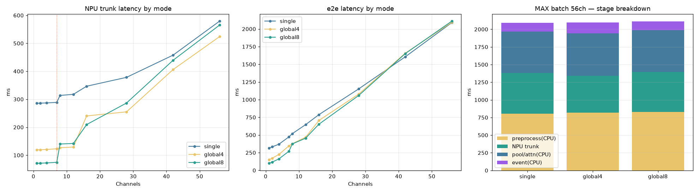

# [hybrid · before] 코어모드 × 파이프라인 단계별 지연 × 채널(최대 56) — 종합

> **[UPDATE 2026-06]** 이 문서는 **hybrid 시절**(NPU trunk + **CPU attn_pool**, cos 0.997)의 벤치마크다.
> 여기서 분석한 `Pool(CPU attn_pool)` 병목은 이후 **QKᵀ 16bit → full NPU**(attn_pool도 NPU, cos 0.99)로
> **제거**되었다. 현재 구성의 동일 측정: [`NPU_pe_pipeline_e2e_full.md`](NPU_pe_pipeline_e2e_full.md).
> 원인·해결: [`../vendor/mobilint_resolution_attn_pool.md`](../vendor/mobilint_resolution_attn_pool.md).

`service._detect` 파이프라인을 단계별로 쪼개, **3개 코어모드 MXQ**로 **채널 1~56(=7카드×8코어 최대배치)**
까지 e2e·단계별 지연을 실측. NPU 추론 병목이 어디서·언제 커지는지 종합. 현재 7×ARIES(GPU 없음, CPU+NPU).

**단계**: `[P]전처리(CPU)` → `[T]NPU trunk(INT8, 7카드 async)` → `[Pool]attn_pool+proj(CPU)` → `[E]event/알람(CPU)`
- `Pool` = **attention pooling head(attn_pool)** — NPU INT8서 깨져 CPU float로 둔 부분(채널별 직렬).
- 측정: median of 5, 실제 영상 프레임. 모드는 컴파일 시 결정(`pe_npu.compile --scheme`).



## 1. NPU trunk 단계 — 모드별 (ms)

| ch | single | global4 | global8 |
|---:|---:|---:|---:|
| 1 | 285.6 | 119.0 | **71.0** |
| 4 | 286.9 | 120.6 | **72.4** |
| 7 | 288.8 | 122.9 | **74.6** |
| 8 | 313.7 | **126.7** | 140.0 |
| 12 | 317.5 | **129.1** | 142.0 |
| 16 | 346.6 | 240.4 | 209.5 |
| 28 | 378.3 | 255.0 | 286.6 |
| 42 | 457.7 | 406.1 | 439.3 |
| 56 | 579.3 | 524.0 | 565.2 |

**병목 = 카드당 동시 처리 슬롯 = 8 / (이미지당 코어)**: single 8슬롯(코어1/img), global4 2슬롯(코어4/img), global8 1슬롯(코어8/img).
- **≤7ch**: global8(71) < global4(119) < single(286). global이 1장을 코어 분담해 빠름.
- **8ch**: global8 **2배 튐**(74→140, 1슬롯/카드라 8번째가 다음 웨이브) / global4 **거의 평탄**(123→127, 2슬롯) / single 소폭(289→314).
- **56ch(최대)**: **3모드 수렴**(524~579ms) — NPU 완전 포화 시 모드 무관(총 연산량 동일).

## 2. e2e 단계별 — 모드별 (ms, P/T/Pool/E)

**single**
| ch | P | T | Pool | E | e2e |
|---:|---:|---:|---:|---:|---:|
| 7 | 97 | 289 | 71 | 17 | 474 |
| 16 | 236 | 347 | 165 | 39 | 787 |
| 28 | 415 | 378 | 289 | 71 | 1153 |
| 42 | 611 | 458 | 437 | 101 | 1606 |
| **56** | **802** | 579 | **584** | 124 | **2090** |

**global4**
| ch | P | T | Pool | E | e2e |
|---:|---:|---:|---:|---:|---:|
| 7 | 120 | 123 | 83 | 21 | 347 |
| 16 | 233 | 240 | 190 | 42 | 705 |
| 28 | 436 | 255 | 305 | 83 | 1079 |
| 42 | 668 | 406 | 474 | 109 | 1657 |
| **56** | **817** | 524 | **603** | 150 | **2095** |

**global8**
| ch | P | T | Pool | E | e2e |
|---:|---:|---:|---:|---:|---:|
| 1 | 21 | 71 | 5 | 2 | 99 |
| 7 | 103 | 75 | 74 | 18 | 270 |
| 16 | 237 | 210 | 164 | 41 | 652 |
| 28 | 415 | 287 | 291 | 67 | 1060 |
| 42 | 658 | 439 | 444 | 111 | 1652 |
| **56** | **830** | 565 | **590** | 125 | **2111** |

## 3. 최대 배치(56ch) 병목 분해 — 어디서 가장 커지나

56채널 e2e ≈ **2090~2111ms (3모드 거의 동일)**. 단계 비중:
| 단계 | single 56ch | 비중 | 자원 |
|------|---:|---:|---|
| **P 전처리** | 802ms | **38%** | CPU (단일스레드 resize) |
| **Pool(attn_pool)** | 584ms | **28%** | CPU (채널별 직렬) |
| **T NPU trunk** | 579ms | 27% | NPU |
| E event | 124ms | 6% | CPU |
| **CPU 합(P+Pool+E)** | **1510ms** | **~72%** | — |

→ **최대 배치에선 병목이 NPU가 아니라 CPU(전처리 + attn_pool)** = e2e의 ~72%. NPU trunk는 27%뿐.
→ 그리고 **코어모드를 바꿔도 56ch e2e는 거의 안 변함**(trunk 수렴 + CPU단 동일). 모드 최적화는 **저채널에서만** 의미.

## 4. 종합 결론 — 병목은 채널대에 따라 이동

| 채널대 | 병목 | 최적 처방 |
|------|------|-----------|
| **≤7 (실시간)** | single이면 NPU trunk(286). | **global8 MXQ**(trunk 71) → e2e 474→270ms |
| **8~14** | global8은 8ch서 2배. | **global4**(trunk ~127 평탄) |
| **고채널~최대(56)** | **CPU(전처리 802 + attn_pool 584)** — 모드 무관 | **① 전처리 멀티프로세스**(6x, `NPU_preprocess_1_parallel.md`) **② attn_pool 배치/스레드** |

**핵심:**
1. **저채널 NPU 병목 → global8/global4로 해소.** 56ch에선 모드 무관(수렴).
2. **최대 배치 병목은 CPU 단(전처리 + attn_pool)** — global로 NPU를 줄여도 CPU가 천장. **CPU 병렬화가 고채널 핵심.**
3. **attn_pool(Pool)** = NPU INT8 미지원으로 CPU에 남긴 어텐션 풀. 채널별 직렬이라 고채널서 584ms까지 커짐 → 배치/스레드 또는 (난이도↑)NPU 포팅이 다음 과제.

## 5. 재현
```bash
conda activate pe_npu_host
python ../scripts/profile_stages.py --mxq <mode>.mxq --label <mode>   # 모드별 단계 P/T/Pool/E + e2e
```
- 원자료: `../assets/npu_pe_pipeline_e2e_hybrid.csv` · 차트: `../assets/npu_pe_pipeline_e2e_hybrid.png` · 스크립트: `../scripts/profile_stages.py`
- 관련: [`NPU_coremode_benchmark.md`](NPU_coremode_benchmark.md)(모드 latency·메모리), [`NPU_pe_stage_latency_hybrid.md`](NPU_pe_stage_latency_hybrid.md)(single 단계), [`NPU_preprocess_1_parallel.md`](NPU_preprocess_1_parallel.md)
