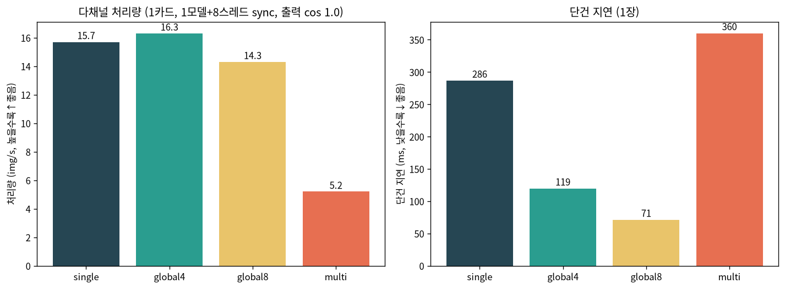

# [full · after] 다채널 처리량 — 올바른 동시성 패턴 & 모드 선택 (출력검증)

**목표**: 여러 다른 이미지를 NPU로 가장 빠르게 처리하는 코어모드/패턴. **출력이 정확한 것만** 채택.

## 0. 결론 (먼저)

- **동시성 패턴 = 카드당 1모델 + 멀티스레드 동기 `infer()`.** 출력 정확(cos 1.0) + 코어 전부 활용.
- **처리량 우선 → `global4`(16.3 img/s) 또는 `single`(15.7).** 단건 지연 우선 → **`global8`(71ms)**. `multi`는 비권장.
- **8장 서버/62채널**: 채널을 8카드에 분산, 카드마다 1모델+스레드 → **≈130 img/s → 62채널 ~0.5초, 출력 정확.**

## 1. 동시성 패턴 — 셋 중 무엇을 쓸까 (실측)

같은 1카드(single MXQ)에서 서로 **다른 이미지 32장**을 처리:

| 패턴 | img/s | 출력검증 | 판정 |
|------|---:|:---:|------|
| 1모델, **단일스레드** sync (현재 레포 기본 루프) | 3.5 | cos 1.0 | 정확하나 **코어 1개만** 씀(느림) |
| **1모델 + 8스레드 sync** ✅ | **15.7** | **cos 1.0** | **정확 + 8코어 활용. 표준 채택** |
| 8모델(인스턴스) + 8스레드 sync | 15.7 | cos 1.0 | 속도 동일, **메모리만 8배 낭비** → 불필요 |
| 1모델 + `infer_async` 여러 건 | (빠름) | **cos ~0/nan ❌** | **출력 깨짐 — 사용 금지** |

- **`infer_async`(async pipeline)는 한 모델당 파이프라인 1개**라 여러 건을 동시에 넣으면 출력버퍼가 충돌 → 첫 건만 맞고 나머지는 0/garbage(**N=1만 안전**).
- **동기 `infer()`는 호출마다 독립 완결**이라, 여러 스레드에서 동시에 불러도 런타임이 코어에 안전 분배 → **안 깨지고 코어를 다 씀**. (SDK `docs/advanced_usage.md`의 "멀티스레딩" 경로.)
- → `pe_npu.MXQInferenceFull(num_threads=8)`이 이 패턴을 내장(`infer()` 배치 시 스레드풀).

## 2. 코어모드 비교 (올바른 패턴, 1카드, 다른 이미지 32장)



| 모드 | 처리량 img/s | 단건지연 ms | 출력검증 | 용도 |
|------|---:|---:|:---:|------|
| **global4** | **16.3** | 119 | cos 1.0 | **처리량+지연 균형 (다채널 추천)** |
| **single** | 15.7 | 286 | cos 1.0 | 처리량 (단건 지연은 큼) |
| **global8** | 14.3 | **71** | cos 1.0 | **단건/저채널 실시간(지연 최소)** |
| multi | 5.2 | 360 | cos 1.0 | 비권장 |

- 올바른 스레드 패턴에선 single/global4/global8이 처리량 14~16 img/s로 **접근**하고(예전 async·multi-instance 측정보다 차이 작음), **global4가 근소 우위 + 단건 119ms로 균형이 좋다.**
- **global8**은 8코어를 1장에 몰아 단건 71ms(최저)지만, 다채널 총처리량은 소폭 낮다.
- **multi**는 이 워크로드(작은 단일 입력)에 부적합.

## 3. 8장 서버 / 62채널 권장 구성

- **카드당 1모델 + 8스레드 sync**, 채널을 8카드에 라운드로빈 분산.
- 처리량 우선이면 **global4**(또는 single), 실시간 저지연이면 **global8**.
- 예상: 카드당 ~16 img/s × 8 ≈ **128 img/s → 62채널 배치 ~0.48초**, 출력 정확.
- 코드: `MXQInferenceFull.from_hf(scheme="global4", num_threads=8)` 를 카드마다 하나씩(`device_id`), 채널 분배는 서비스단.

## 4. 재현
```bash
conda activate pe_npu_host
python ../scripts/bench_throughput_correct.py 1 32     # 패턴 비교(단일/1모델8스레드/8모델8스레드)
python ../scripts/bench_modes_threaded.py 1 32 8       # 모드 비교(1모델+8스레드, 출력검증)
```
- 원자료: `bench_modes_threaded.json`. 관련: [`NPU_pe_1card_coremode_full.md`](NPU_pe_1card_coremode_full.md)(모드별 채널 증가, latency), [`NPU_pe_multicard_62ch_full.md`](NPU_pe_multicard_62ch_full.md)(멀티카드).

> **주의**: 본 문서 외의 `NPU_multicard_62ch_full`, `NPU_pe_1card_coremode_full`, `NPU_full_pipeline_e2e`,
> `NPU_pe_hybrid_vs_full`는 `infer_async`(같은 이미지)로 **latency만** 측정했다 — 시간 수치는 유효하나
> **출력 정확성은 미검증**(서로 다른 이미지면 async는 깨짐). 실제 다채널 정확 처리는 본 문서의 패턴을 쓸 것.

*작성 2026-07. full NPU(QKᵀ16bit) 1카드(aries1) 실측, 서로 다른 이미지 32장, median 아님(단일 배치 wall-clock), 출력 cos 1.0 검증.*
