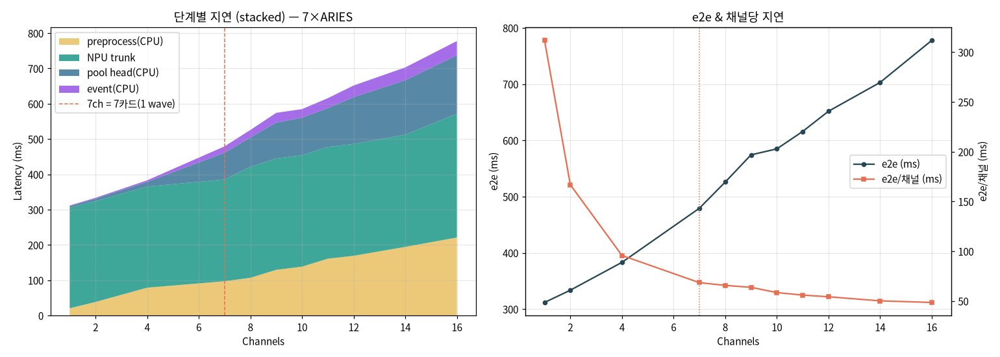

# [비포·hybrid] PE-NPU 파이프라인 단계별 지연 + e2e (single 모드, 채널 스윕)

> **[UPDATE 2026-06]** 이 문서는 **hybrid 시절**(NPU trunk + **CPU pool**) single 모드 측정이다.
> 여기서 "고채널 병목 = CPU단(전처리+pool)"이라 한 그 **Pool(CPU attn_pool) 단계는 이후
> QKᵀ 16bit → full NPU**로 **제거**됐다(attn_pool도 NPU). full NPU 동일 측정(같은 채널 스윕):
> [`NPU_full_pipeline_e2e.md`](NPU_full_pipeline_e2e.md)(4모드) · 직접 비포/애프터 한 표:
> [`NPU_full_vs_hybrid.md`](NPU_full_vs_hybrid.md). 원인·해결: [`../vendor/mobilint_resolution_attn_pool.md`](../vendor/mobilint_resolution_attn_pool.md).

이미지 리스트(N채널)가 동시에 들어올 때 `service._detect` 파이프라인을 단계별로 쪼개
각 단계 지연과 end-to-end(e2e)를 실측. (당시 hybrid 구성, 7×ARIES 서버 GPU 없음, CPU+NPU.)

**파이프라인 단계**
```
[P] 전처리(CPU)   원본 N장 → resize336+normalize → (N,3,336,336)
[T] NPU trunk     24 transformer block(INT8 feat MXQ), 7카드 라운드로빈 async
[Pool] pool head  attn_pool+proj (CPU float, 채널별)
[E] event/알람    텍스트 유사도 retrieval + duration 상태머신
```
- MXQ = **Single 모드**(HF `pe_feat.mxq`). 측정: 채널 수마다 median of 7. 입력=실제 영상 프레임.

## 1. 단계별 지연 (ms, 7카드 분산)

| ch | P 전처리 | T NPU추론 | Pool(CPU) | E event | **e2e** | e2e/ch |
|---:|---:|---:|---:|---:|---:|---:|
| 1 | 20.6 | 285.1 | 4.7 | 1.4 | **311.8** | 311.8 |
| 2 | 38.5 | 285.6 | 7.3 | 2.2 | **333.6** | 166.8 |
| 4 | 79.0 | 286.4 | 13.3 | 4.4 | **383.1** | 95.8 |
| 7 | 97.2 | 288.3 | 75.6 | 18.2 | **479.4** | 68.5 |
| 8 | 107.0 | 314.3 | 83.1 | 21.4 | **525.9** | 65.7 |
| 9 | 129.5 | 315.5 | 101.6 | 27.6 | **574.3** | 63.8 |
| 10 | 138.5 | 315.7 | 106.4 | 24.2 | **584.9** | 58.5 |
| 11 | 161.1 | 316.6 | 110.0 | 28.1 | **615.8** | 56.0 |
| 12 | 169.3 | 316.9 | 132.5 | 33.0 | **651.7** | 54.3 |
| 14 | 194.5 | 317.8 | 154.3 | 36.3 | **702.8** | 50.2 |
| 16 | 221.1 | 350.8 | 165.3 | 40.4 | **777.6** | 48.6 |



## 2. 단계별 특성

| 단계 | 채널 증가 시 | 비고 |
|------|------|------|
| **T NPU trunk** | **1~7ch 평탄(~285ms)** → 8ch부터 ~315ms → 16ch 351ms | 7카드 병렬: 채널마다 다른 카드 → ⌈N/7⌉ 웨이브. **≤7ch는 1웨이브라 거의 불변**, 8~14ch=2웨이브 |
| **P 전처리(CPU)** | 선형 ~14ms/ch (1ch 21 → 16ch 221) | 단일 스레드 torchvision resize, 채널수 비례 |
| **Pool head(CPU)** | 저채널 작음(≤4ch <15ms) → 7ch+ 급증(75→165ms) | 채널별 attn_pool 직렬, CPU 경합. (7ch 점프는 측정변동 포함) |
| **E event(CPU)** | 1~40ms, N에 따라 증가 | 유사도 matmul(N×13449) + 상태머신, 비교적 작음 |

## 3. 핵심 인사이트

1. **저채널(≤4)은 NPU trunk(~285ms)가 절대지배** — 전처리·pool·event 합쳐 30~100ms뿐. e2e 312→383ms.
2. **trunk가 1~7ch 평탄** = 7카드 병렬 덕에 **채널 추가가 지연상 거의 공짜**. e2e/ch가 312→49ms로 급감(멀티채널 효율↑).
3. **8ch 넘으면 두 축에서 증가**: ① trunk 2웨이브(~315ms) ② CPU단(전처리+pool+event)이 선형 누적. 16ch e2e 778ms.
4. **고채널 병목은 NPU가 아니라 CPU단**(전처리+pool+event): 16ch에서 CDF상 전처리 221 + pool 165 + event 40 = 426ms > trunk 351ms.

## 4. 최적화 방향 (이미지 리스트 입력)

| 우선순위 | 방향 | 효과/근거 |
|---|---|---|
| **1 (저채널 실시간)** | **global8 MXQ로 컴파일** | trunk **285→70ms** (`NPU_coremode_benchmark.md`). 2~4ch e2e ~334→~120ms. single=throughput, global8=latency |
| **2 (고채널)** | **전처리 멀티프로세스** | CPU resize 선형병목 완화(6x, `NPU_preprocess_parallel.md`). `ParallelPreprocessor(mode=process)` |
| **3 (고채널)** | **pool head 배치/스레드** | 7ch+ pool 직렬(75~165ms) 완화 (단 CPU 경합 주의) |
| **4** | **파이프라이닝** | 다음 배치 전처리를 현재 NPU 추론과 오버랩 → 전처리 숨김 |
| — | NPU 배치입력 | ❌ 불가(single MXQ는 1호출 1장) → 카드별 async가 정답 |

## 5. 결론 (2/4채널)
- 현재(single+7카드 async): **2ch 334ms / 4ch 383ms**. trunk 1웨이브(~285ms)가 바닥, 채널 추가는 NPU 병렬로 거의 안 늘어남.
- **2~4채널 실시간 목표 → global8 MXQ가 결정적**(trunk 70ms → e2e 3배↓). 고채널 throughput → single 유지 + 전처리/pool 병렬화.

## 6. 재현
```bash
conda activate pe_npu_host
python ../scripts/profile_stages.py     # 단계별 P/T/Pool/E + e2e, 채널 스윕
```
- 원자료: `../assets/npu_pipeline_stage.csv` · 차트: `../assets/npu_pipeline_stage.png` · 스크립트: `../scripts/profile_stages.py`
- 관련: [`NPU_coremode_benchmark.md`](NPU_coremode_benchmark.md)(코어모드 latency), [`NPU_multicard_62ch_benchmark.md`](NPU_multicard_62ch_benchmark.md)(멀티카드), [`NPU_preprocess_parallel.md`](NPU_preprocess_parallel.md)(전처리 병렬)
