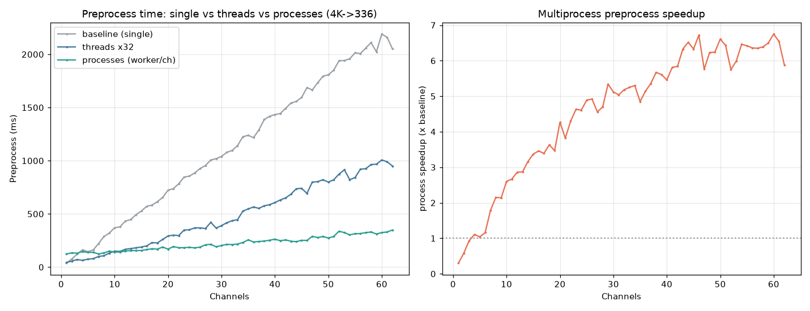

# [전처리 ① 병렬화] 전처리(Preprocess) 병렬화 벤치마크 — 단일 vs 스레드 vs 멀티프로세스

멀티카드 벤치(`NPU_pe_multicard_62ch_hybrid.md`)에서 **고채널의 진짜 병목이 전처리(CPU)**
임이 드러났다(56채널 기준 전처리 ≫ 추론). 그 전처리를 병렬화해 얼마나 줄어드는지 1→62채널로 측정.

- 전처리 = 4K 원본(3836×2146) → resize 336 + normalize 0.5 → HWC float32 (모델 입력)
- NPU 추론과 달리 **채널마다 완전 독립 + 순수 CPU + NPU 구동과 경합 없음** → 코어 분산이 잘 먹힌다

## 1. 비교 방식

| 방식 | 구현 |
|---|---|
| **baseline** | 단일 프로세스, `preprocess_image([img]*N)` 배치 1콜 (torchvision 내부 스레드) |
| **threads** | `ThreadPoolExecutor(32)`, 채널당 torchvision 전처리 (torch가 GIL 일부 해제) |
| **processes** | `multiprocessing.Pool`, **채널당 워커**, 워커당 `torch.set_num_threads(1)` (프로세스 병렬, oversubscribe 방지) |

- 호스트 Xeon Gold 6526Y (64T). 프로세스 풀은 1회 생성 후 재사용(워커 startup 비용 분리).
- 채널 수마다 3회 median.

## 2. 핵심 결과

- **멀티프로세스가 압도적** — 56채널 전처리 **2007ms → 315ms (×6.4)**, 채널당 36ms → **5.6ms**.
- **스레드도 효과 있음**(×2.2, 56채널 921ms) — torchvision이 GIL을 일부 해제하기 때문. 단 프로세스의 절반 수준.
- **작은 배치(≤4채널)는 프로세스가 오히려 느림** — 워커 dispatch + 결과 IPC(장당 1.3MB) 오버헤드. **크로스오버 ≈ 7채널**.
- 채널당 비용이 7채널부터 급감(워커가 코어에 1:1 분산되기 시작).



### 전체 배치시간에 미치는 효과 (56채널, 전처리+추론)
| | 전처리 | + NPU 추론(7대) | 합계 |
|---|---:|---:|---:|
| 기존(baseline 전처리) | ~2007ms | 519ms | ~2526ms |
| **멀티프로세스 전처리** | **315ms** | 519ms | **~834ms** |

→ 전처리 병렬화로 전체 배치시간 **약 3배 단축**. 이제 병목이 다시 **NPU 추론(519ms)** 으로 넘어가 올바른 위치(NPU-bound)가 된다.

## 3. 권장 적용

- **≥7채널: 멀티프로세스 풀**(채널당 워커, 워커 torch 1스레드). 풀은 서비스 起動 시 1회 생성해 재사용.
- **<7채널: baseline 단일**(IPC 오버헤드 회피). → 배치 크기로 분기하는 하이브리드가 최적.
- 운영에선 각 채널 프레임을 **워커가 직접 디코드+전처리**하면 입력 IPC도 사라져 더 유리(여기 측정은 동일 프레임 재사용 보수적 케이스).

## 4. 채널별 측정 (1→62)

baseline / threads / process (ms, median), process speedup(×baseline), process 채널당(ms)

| ch | baseline | threads | process | proc ×↑ | proc/ch |
|---:|---:|---:|---:|---:|---:|
| 1 | 37.2 | 44.4 | 124.2 | 0.30 | 124.17 |
| 2 | 77.5 | 56.5 | 133.6 | 0.58 | 66.78 |
| 3 | 121.8 | 71.3 | 131.0 | 0.93 | 43.67 |
| 4 | 162.4 | 63.8 | 146.6 | 1.11 | 36.65 |
| 5 | 144.4 | 74.6 | 138.3 | 1.04 | 27.66 |
| 6 | 161.7 | 79.4 | 139.3 | 1.16 | 23.21 |
| 7 | 221.7 | 100.3 | 123.8 | 1.79 | 17.69 |
| 8 | 287.4 | 106.9 | 133.4 | 2.15 | 16.67 |
| 9 | 319.8 | 131.8 | 149.5 | 2.14 | 16.61 |
| 10 | 369.7 | 149.9 | 142.1 | 2.60 | 14.21 |
| 11 | 378.4 | 147.7 | 141.7 | 2.67 | 12.88 |
| 12 | 432.7 | 167.8 | 151.2 | 2.86 | 12.60 |
| 13 | 446.5 | 174.3 | 155.3 | 2.87 | 11.95 |
| 14 | 493.0 | 181.4 | 156.1 | 3.16 | 11.15 |
| 15 | 527.0 | 188.9 | 156.2 | 3.37 | 10.41 |
| 16 | 571.3 | 199.4 | 165.3 | 3.46 | 10.33 |
| 17 | 583.5 | 230.3 | 172.2 | 3.39 | 10.13 |
| 18 | 615.0 | 227.4 | 169.3 | 3.63 | 9.40 |
| 19 | 655.3 | 260.4 | 188.6 | 3.47 | 9.93 |
| 20 | 723.1 | 292.5 | 169.2 | 4.27 | 8.46 |
| 21 | 738.0 | 300.8 | 193.2 | 3.82 | 9.20 |
| 22 | 783.6 | 296.5 | 182.2 | 4.30 | 8.28 |
| 23 | 846.0 | 348.6 | 182.6 | 4.63 | 7.94 |
| 24 | 855.6 | 351.0 | 185.6 | 4.61 | 7.73 |
| 25 | 885.7 | 368.9 | 181.0 | 4.89 | 7.24 |
| 26 | 926.6 | 368.6 | 188.2 | 4.92 | 7.24 |
| 27 | 954.8 | 362.7 | 209.2 | 4.56 | 7.75 |
| 28 | 1007.1 | 420.4 | 214.5 | 4.70 | 7.66 |
| 29 | 1019.2 | 367.3 | 190.9 | 5.34 | 6.58 |
| 30 | 1040.7 | 389.9 | 203.4 | 5.12 | 6.78 |
| 31 | 1078.5 | 417.2 | 213.8 | 5.04 | 6.90 |
| 32 | 1097.0 | 436.2 | 211.9 | 5.18 | 6.62 |
| 33 | 1141.5 | 445.3 | 217.3 | 5.25 | 6.58 |
| 34 | 1225.5 | 526.3 | 231.4 | 5.30 | 6.80 |
| 35 | 1238.7 | 546.9 | 255.5 | 4.85 | 7.30 |
| 36 | 1216.9 | 565.2 | 236.7 | 5.14 | 6.57 |
| 37 | 1290.0 | 552.3 | 240.9 | 5.36 | 6.51 |
| 38 | 1386.7 | 576.1 | 244.6 | 5.67 | 6.44 |
| 39 | 1417.4 | 586.9 | 252.6 | 5.61 | 6.48 |
| 40 | 1434.3 | 606.5 | 262.9 | 5.46 | 6.57 |
| 41 | 1443.8 | 631.4 | 248.5 | 5.81 | 6.06 |
| 42 | 1492.6 | 650.4 | 255.4 | 5.84 | 6.08 |
| 43 | 1541.9 | 685.0 | 243.8 | 6.33 | 5.67 |
| 44 | 1557.2 | 736.6 | 238.8 | 6.52 | 5.43 |
| 45 | 1594.4 | 740.6 | 251.8 | 6.33 | 5.60 |
| 46 | 1687.4 | 692.8 | 251.0 | 6.72 | 5.46 |
| 47 | 1664.9 | 799.1 | 288.8 | 5.76 | 6.15 |
| 48 | 1732.8 | 803.0 | 278.2 | 6.23 | 5.80 |
| 49 | 1794.4 | 821.6 | 287.4 | 6.24 | 5.87 |
| 50 | 1808.0 | 799.1 | 273.6 | 6.61 | 5.47 |
| 51 | 1850.7 | 820.5 | 287.8 | 6.43 | 5.64 |
| 52 | 1939.3 | 874.1 | 337.4 | 5.75 | 6.49 |
| 53 | 1941.4 | 915.1 | 324.2 | 5.99 | 6.12 |
| 54 | 1958.0 | 821.9 | 303.2 | 6.46 | 5.62 |
| 55 | 2014.0 | 841.9 | 313.9 | 6.42 | 5.71 |
| 56 | 2007.0 | 920.7 | 315.5 | 6.36 | 5.63 |
| 57 | 2059.3 | 925.1 | 324.3 | 6.35 | 5.69 |
| 58 | 2110.0 | 964.0 | 330.0 | 6.39 | 5.69 |
| 59 | 2023.3 | 966.9 | 311.3 | 6.50 | 5.28 |
| 60 | 2190.5 | 1007.2 | 324.6 | 6.75 | 5.41 |
| 61 | 2160.3 | 990.3 | 330.2 | 6.54 | 5.41 |
| 62 | 2050.9 | 950.2 | 349.0 | 5.88 | 5.63 |

## 5. 재현
```bash
conda activate pe_npu_host
python ../scripts/bench_preprocess.py     # 1→62채널, baseline/threads/process → ../assets/npu_preprocess_1_parallel.csv
```
- 원자료: `../assets/npu_preprocess_1_parallel.csv` · 차트: `../assets/npu_preprocess_1_parallel.png` · 스크립트: `../scripts/bench_preprocess.py`
- 입력: 실제 4K 프레임. baseline 절대값은 torch 스레드 컨텍스트에 따라 멀티카드 리포트와 다소 차이날 수 있으나, **상대 가속비**가 결론.
